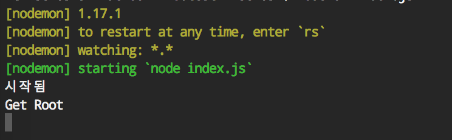
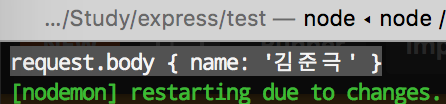
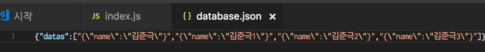

이 글은 [블로그](http://wagunblog.com/wp/?p=2511)에 작성한 글을 그대로 가져왔습니다.

# express를 이용한 간단한 CRUD

로컬에서 간단하게 express를 이용하여 CRUD를 구성해보기로 했다.

여기서는 file 동기, 비동기, 미들웨어, HTTP 메서드(POST, GET, PUT, PATCH, DELETE) 등 추가 설명은 하지 않고 지나간다.

## 프로젝트 생성 및 환경 설정

```
// 폴더생성
mkdir test

// 폴더이동
cd test/

// npm 초기화
npm init -y
{
  "name": "test",
  "version": "1.0.0",
  "description": "",
  "main": "index.js",
  "scripts": {
    "test": "echo \"Error: no test specified\" && exit 1"
  },
  "keywords": [],
  "author": "",
  "license": "ISC"
}

// express 설치
npm install express --save

// nodemon (버전 확인)
nodemon --version

// nodemon (nodemon이 없는 경우 설치)
npm install nodemon -g
```

nodemon은 nodemon이 시작된 디렉토리의 파일을 감시하고 파일이 변경되면 nodemon은 자동으로 노드 응용 프로그램을 다시 시작합니다.
(참고 : [github.com/remy/nodemon](https://github.com/remy/nodemon))

## Hello World

//  파일 생성
```
touch index.js
```

// 샘플 코드 작성(index.js)
```
const express = require("express")
const app = express()

app.get("/", (request, response) => {
    console.log("Get Root")
    response.end()
})

app.listen(3000, () => {
    console.log("시작됨")
})
```

// nodemon 실행
```
nodemon index.js
```

// 브라우저로 http://localhost:3000 접근하면 다음과 같은 결과물이 나온다.
```
[nodemon] starting `node index.js`
시작됨
Get Root
```


## DB json 만들기

DB를 만들어서 연결할 수도 있겠지만, 간단하기 json 파일을 생성하여 해당 파일을 read, write하는 방법으로 CRUD를 만들려고 한다.

// json 파일 생성
```
touch database.json
```

// database.json 코드 작성(database.json)
```
{"datas": []}
```

### Create

<strong>body-parser 미들웨어</strong> 모듈 추가<br />
(참고 : [body-parser](https://github.com/expressjs/body-parser))

```
npm install body-parser --save
// 추가 후 nodemon 재시작
```

// index.js 코드 중
```
const bodyParser = require("body-parser")

app.use(bodyParser.urlencoded({ extended: true }))

app.post("/wise", (request, response) => {
    console.log("request.body", request.body)
    response.end()
})
```

다음과 같이 postman을 통해서 x-www-form-urlencoded의 key, value를 입력하고 전송(Send)


다음과 같이 전송한 key(name), value(김준극)값을 얻을 수 있다.



이제 아까 생성한 json 파일에 write 해보자.

// index.js 코드 중
```
// 추가
const fs = require('fs')
const path = require('path')
const dbPath = path.join(__dirname, 'database.json')

// 기존 코드 수정 (fs.readFile, fs.writeFile을 이용하여 파일 읽고 쓰기)
app.post("/wise", (request, response) => {
    fs.readFile(dbPath, { encoding: 'utf-8' }, (err, data) => {
        if (!err) {
            const database = JSON.parse(data)
            database.datas.push(JSON.stringify(request.body))
            fs.writeFile(dbPath, JSON.stringify(database), (err) => {
                if (err) throw err;
                console.log('The file has been saved!');
            });
            response.end();
        } else {
            console.log(err);
        }
    })
})
```

postman을 통해서 몇개의 데이터를 추가하고 database.json을 확인해보니 다음과 같이 수정되었다.
```
{"datas":["{\"name\":\"김준극\"}","{\"name\":\"김준극1\"}","{\"name\":\"김준극2\"}","{\"name\":\"김준극3\"}"]}
```



### Read

database.json에 등록된 datas배열에서 query.idx를 사용하여 값을 가져오는 코드.

// index.js 코드 중
```
app.get("/wise", (request, response) => {
    fs.readFile(dbPath, { encoding: 'utf-8' }, (err, data) => {
        if (!err) {
            const database = JSON.parse(data)
            console.log(database.datas[request.query.idx]);
            response.end();
        } else {
            console.log(err);
        }
    })
})
```

// 접근 경로에 따른 결과값
```
// http://localhost:3000/wise
undefined

// http://localhost:3000/wise?idx=1
{"name":"김준극1"}

// http://localhost:3000/wise?idx=2
{"name":"김준극2"}

// http://localhost:3000/wise?idx=3
{"name":"김준극3"}

// http://localhost:3000/wise?idx=4
undefined

// http://localhost:3000/wise?idx=0
{"name":"김준극"}
```

### Update

// index.js 코드 중
```
app.put("/wise", (request, response) => {
    fs.readFile(dbPath, { encoding: 'utf-8' }, (err, data) => {
        if (!err) {
            const database = JSON.parse(data)
            database.datas[request.query.idx] = JSON.stringify(request.body)
            fs.writeFile(dbPath, JSON.stringify(database), (err) => {
                if (err) throw err;
                console.log('The file has been saved!');
            });
            response.end();
        } else {
            console.log(err);
        }
    })
})
```

http://localhost:3000/wise?idx=2 (Put) {"name" : "WisePut"}

// 접근 경로에 따른 결과값
```
// http://localhost:3000/wise?idx=2
{"name":"WisePut"}
```

### Delete

현재 database.json에는 다음과 같이 되어있다.

```
{"datas":["{\"name\":\"김준극\"}","{\"name\":\"김준극1\"}","{\"name\":\"WisePut\"}","{\"name\":\"김준극3\"}"]}
```

// index.js 코드 중
```
app.delete("/wise", (request, response) => {
    fs.readFile(dbPath, { encoding: 'utf-8' }, (err, data) => {
        if (!err) {
            const database = JSON.parse(data)
            database.datas[request.query.idx] = {}
            console.log("database", database)
            // fs.writeFile(dbPath, JSON.stringify(database), (err) => {
            //     if (err) throw err;
            //     console.log('The file has been saved!');
            // });
            response.end();
        } else {
            console.log(err);
        }
    })
})
```

http://localhost:3000/wise?idx=2 (delete)

```
database { datas: [ '{"name":"김준극"}', '{"name":"김준극1"}', {}, '{"name":"김준극3"}' ] }
```
